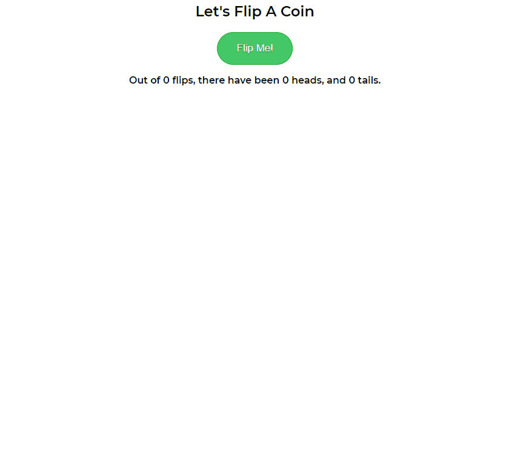

# Getting Started with Create React App

This project was bootstrapped with [Create React App](https://github.com/facebook/create-react-app).

## Available Scripts

In the project directory, you can run:

### `yarn start`

Runs the app in the development mode.\
Open [http://localhost:3000](http://localhost:3000) to view it in the browser.

The page will reload if you make edits.\
You will also see any lint errors in the console.

---

# Coin Flip Application

This React exercise gives you some practice working with props, defaultProps, state, and simple click events in React.

- The user should be able to click on a button to flip a coin. Every time the user clicks, the coin gets flipped again. The app should also keep track of how many times heads and tails have shown up.

## Preview of app in action

